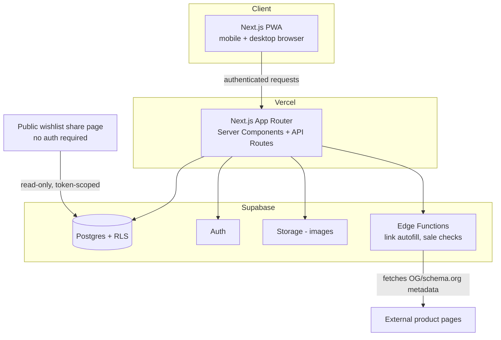

# Architecture

## System Overview

## Multi-Tenancy Model

Every user-owned table (`items`, `wishlists`, `wishlist_items`, custom `categories`/`item_types`) carries a `user_id` column tied to `auth.uid()`. Row Level Security policies enforce that a user can only read/write their own rows — this is enforced at the database layer, so even a bug in application code can't leak cross-user data.

System-level defaults (the default Category/Item Type taxonomy) live in the same tables with `user_id IS NULL` and `is_system = true`. Every user sees the system defaults plus any rows they've added themselves. See `DATABASE.md` for the exact policies.

## Public Wishlist Sharing

Shared wishlists must be viewable with **no login**. This is the one deliberate exception to "everything goes through RLS as the authenticated user":

- Each `wishlists` row has a unique, unguessable `share_token`.
- A narrow, explicit RLS policy allows anonymous (`anon` role) `SELECT` on a wishlist and its items **only when the request includes a valid share token**, via a Postgres function (`get_shared_wishlist(token)`) rather than open table access.
- This keeps the "no login to view" requirement without opening the tables themselves to anonymous reads.
- The schema leaves room for an optional, lightweight anonymous identifier (name + a browser cookie) to be added later for reservation-style features, without changing the sharing model itself.

## Link Autofill Flow

1. User pastes a product URL when adding an item.
2. A Supabase Edge Function fetches the page server-side (avoids CORS issues and keeps scraping logic out of the client).
3. The function parses Open Graph tags (`og:title`, `og:image`) and schema.org `Product`/`Offer` structured data where present (title, image, price, sale price).
4. Whatever fields are found pre-fill the add-item form; anything missing (or wrong) is manually editable before saving — autofill is a convenience, never a blocker.
5. Parsing failures fail gracefully to a fully manual entry — never a hard error.

## Sale Detection

- **V1:** price and sale price captured at the time an item is added or manually refreshed by the user (re-running autofill on an existing item).
- **V1.5/V2:** a scheduled Edge Function periodically re-checks prices for a user's active (non-purchased) items and updates `sale_price`/`discount_percent`, since always-on price monitoring is meaningfully more infrastructure than "check on add."

## Category ↔ Item Type Relationship

`item_types` has a required `category_id` foreign key — a category is a property of the item type, not something chosen independently on each item. When a user picks an item type (e.g. "Makeup"), the category ("Beauty") is derived automatically via that relationship, never stored redundantly on the item itself. This is what guarantees the category is always correct and never drifts out of sync.

## Rendering Strategy

- Server Components for data-heavy views (category/item-type group views, totals) — fetch and aggregate close to the database.
- Client Components only where interactivity demands it (filters, multi-select, star ratings, drag-to-wishlist).

## Future Extension Points (kept in mind now, not built yet)

- **Closet view (V2):** `items` already has an image; a `closets` table can reference existing items plus new standalone closet photos without restructuring `items`.
- **Native app (V2+):** business logic in `lib/` is framework-agnostic where possible, so it can be shared with a future React Native app.
- **Recommendations (V3):** will need purchase-history and interest-level signals already captured in the V1 schema — no retrofit needed to start collecting the right data.
